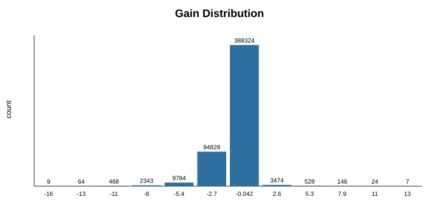
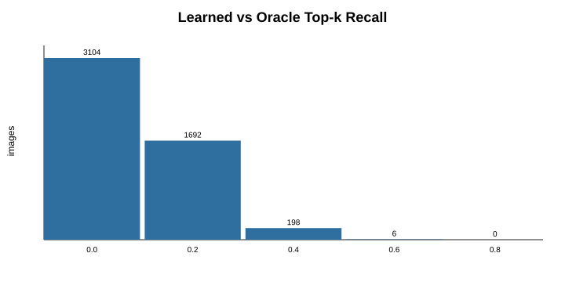
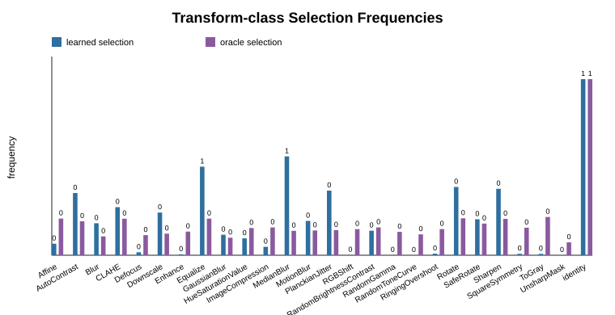
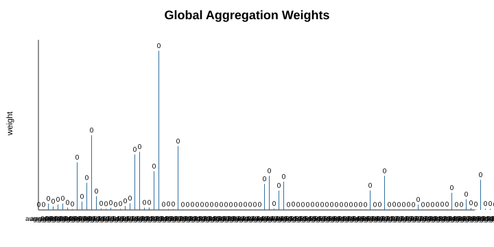
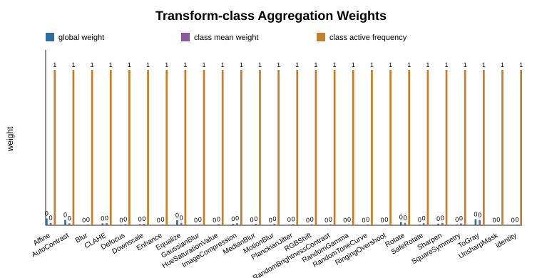
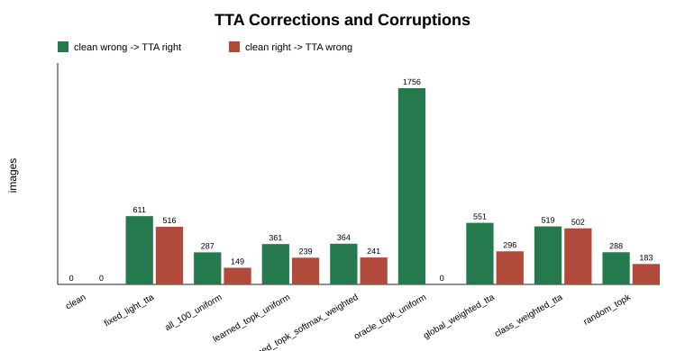
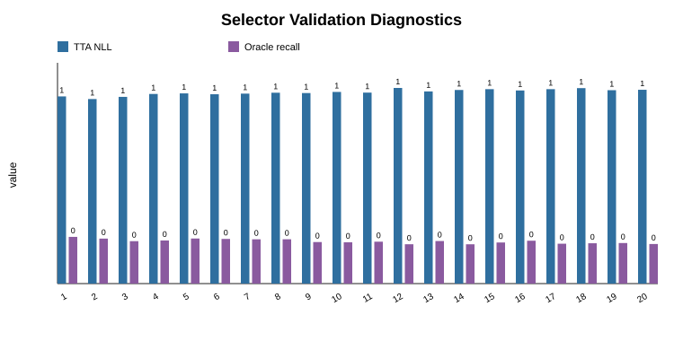

# albu-tta ResNet50 Case Study

Tuned k: 16
Public-val oracle top-k recall: 0.188475

This report is a single-architecture ImageNet validation case study. Run additional architectures before making broad leaderboard claims.

Next-step read: [next_steps.md](next_steps.md).

## Raw Per-Image Scores

Need to eyeball what each augmentation does per image? Start with `tables/selector_public_gain_matrix.csv`: one row is one public image, and `aug_000`...`aug_099` are `clean_nll - aug_nll`. Positive means the augmentation helped that image, negative means it hurt; join `aug_*` with `tables/augmentation_impact.csv` to see the augmentation names.

## Selector Baseline Decision

Current selector baseline: `learned_topk_uniform` with the tuned `k` above. `learned_adaptive_uniform` is kept as an ablation because its low-compute thresholds still lose too much quality; learned aggregation strategies are stronger comparison baselines, not the selector baseline.

## Public Validation Metrics

| strategy | top1 | top5 | nll | ece | forwards_per_image | relative_compute_vs_all |
| --- | --- | --- | --- | --- | --- | --- |
| learned_topk_uniform | 0.819 | 0.9576 | 0.745703 | 0.0405037 | 17 | 0.17 |
| global_weighted_tta | 0.824 | 0.9596 | 0.703692 | 0.0270465 | 100 | 1 |
| class_weighted_tta | 0.894 | 0.9804 | 0.425668 | 0.0527389 | 100 | 1 |

## Private Metrics

| strategy | top1 | top5 | nll | ece | forwards_per_image | relative_compute_vs_all |
| --- | --- | --- | --- | --- | --- | --- |
| clean | 0.80468 | 0.94592 | 0.939441 | 0.0867522 | 1 | 0.01 |
| fixed_light_tta | 0.80848 | 0.94052 | 0.857318 | 0.0460779 | 17 | 0.17 |
| random_topk | 0.80888 | 0.945448 | 0.821023 | 0.0307059 | 17 | 0.17 |
| all_100_uniform | 0.8102 | 0.94696 | 0.791093 | 0.0265595 | 100 | 1 |
| learned_topk_uniform | 0.81008 | 0.94856 | 0.819431 | 0.0431775 | 17 | 0.17 |
| learned_topk_softmax_weighted | 0.81032 | 0.9484 | 0.81952 | 0.042699 | 17 | 0.17 |
| oracle_topk_uniform | 0.87492 | 0.96312 | 0.489845 | 0.0135182 | 17 | 0.17 |
| learned_adaptive_uniform | 0.81004 | 0.9486 | 0.819412 | 0.0431932 | 17 | 0.17 |
| global_weighted_tta | 0.81488 | 0.94984 | 0.771035 | 0.0289746 | 100 | 1 |
| class_weighted_tta | 0.80536 | 0.94128 | 0.839763 | 0.030029 | 100 | 1 |

- Delta table: `tables/private_metric_deltas.csv`

### Private metric deltas vs clean

| strategy | top1_delta_vs_clean | top5_delta_vs_clean | nll_delta_vs_clean | ece_delta_vs_clean | forwards_per_image | relative_compute_vs_all |
| --- | --- | --- | --- | --- | --- | --- |
| clean | 0 | 0 | 0 | 0 | 1 | 0.01 |
| fixed_light_tta | 0.0038 | -0.0054 | -0.0821228 | -0.0406743 | 17 | 0.17 |
| random_topk | 0.0042 | -0.000472 | -0.118418 | -0.0560463 | 17 | 0.17 |
| all_100_uniform | 0.00552 | 0.00104 | -0.148347 | -0.0601927 | 100 | 1 |
| learned_topk_uniform | 0.0054 | 0.00264 | -0.12001 | -0.0435747 | 17 | 0.17 |
| learned_topk_softmax_weighted | 0.00564 | 0.00248 | -0.119921 | -0.0440532 | 17 | 0.17 |
| oracle_topk_uniform | 0.07024 | 0.0172 | -0.449596 | -0.073234 | 17 | 0.17 |
| learned_adaptive_uniform | 0.00536 | 0.00268 | -0.120029 | -0.0435589 | 17 | 0.17 |
| global_weighted_tta | 0.0102 | 0.00392 | -0.168406 | -0.0577776 | 100 | 1 |
| class_weighted_tta | 0.00068 | -0.00464 | -0.0996776 | -0.0567231 | 100 | 1 |

## Compute

| split | strategy | forwards_per_image | relative_compute_vs_all |
| --- | --- | --- | --- |
| public_val | learned_topk_uniform | 17 | 0.17 |
| public_val | global_weighted_tta | 100 | 1 |
| public_val | class_weighted_tta | 100 | 1 |
| private | clean | 1 | 0.01 |
| private | fixed_light_tta | 17 | 0.17 |
| private | random_topk | 17 | 0.17 |
| private | all_100_uniform | 100 | 1 |
| private | learned_topk_uniform | 17 | 0.17 |
| private | learned_topk_softmax_weighted | 17 | 0.17 |
| private | oracle_topk_uniform | 17 | 0.17 |
| private | learned_adaptive_uniform | 17 | 0.17 |
| private | global_weighted_tta | 100 | 1 |
| private | class_weighted_tta | 100 | 1 |

## Augmentation Impact

- Table: `tables/augmentation_impact.csv`

### Top mean-gain augmentations

| aug_id | augmentation_name | transform_class | mean_gain |
| --- | --- | --- | --- |
| aug_029 | shear_y_plus_5 | Affine | 0.0110863 |
| aug_075 | gaussian_blur_sigma_05 | GaussianBlur | 0.00566818 |
| aug_022 | scale_095 | Affine | 0.00396476 |
| aug_028 | shear_y_minus_5 | Affine | 0.00191463 |
| aug_023 | scale_105 | Affine | 0.00150252 |

### Top learned-selection augmentations

| aug_id | augmentation_name | transform_class | selection_frequency |
| --- | --- | --- | --- |
| aug_020 | scale_080 | Affine | 0.9502 |
| aug_086 | sharpen_medium | Sharpen | 0.8978 |
| aug_085 | sharpen_light | Sharpen | 0.7734 |
| aug_010 | rotate_minus_20 | Rotate | 0.7314 |
| aug_032 | brightness_minus_20 | RandomBrightnessContrast | 0.7286 |

### Top oracle-selection augmentations

| aug_id | augmentation_name | transform_class | oracle_frequency |
| --- | --- | --- | --- |
| aug_025 | scale_120 | Affine | 0.2868 |
| aug_005 | square_horizontal | SquareSymmetry | 0.244 |
| aug_024 | scale_110 | Affine | 0.2428 |
| aug_011 | rotate_plus_20 | Rotate | 0.2366 |
| aug_010 | rotate_minus_20 | Rotate | 0.2312 |

- Transform-class table: `tables/transform_class_impact.csv`

### Top transform classes by mean gain

| transform_class | candidate_count | mean_gain | selection_frequency | oracle_frequency |
| --- | --- | --- | --- | --- |
| identity | 1 | 0 | 1 | 1 |
| RandomGamma | 4 | -0.00208149 | 0.0067 | 0.1325 |
| UnsharpMask | 1 | -0.00408824 | 0.0014 | 0.073 |
| RGBShift | 6 | -0.00673984 | 0.0416 | 0.148267 |
| Enhance | 1 | -0.00780114 | 0.2758 | 0.1342 |

## Learned Aggregation Weights

- Table: `tables/aggregation_weights.csv`

### Top global aggregation weights

| aug_id | augmentation_name | transform_class | global_weight |
| --- | --- | --- | --- |
| aug_025 | scale_120 | Affine | 0.182504 |
| aug_011 | rotate_plus_20 | Rotate | 0.085652 |
| aug_029 | shear_y_plus_5 | Affine | 0.0730575 |
| aug_021 | scale_090 | Affine | 0.0667459 |
| aug_020 | scale_080 | Affine | 0.0635984 |

### Top class-mean aggregation weights

| aug_id | augmentation_name | transform_class | class_mean_weight |
| --- | --- | --- | --- |
| aug_072 | gray_weighted | ToGray | 0.0336097 |
| aug_025 | scale_120 | Affine | 0.0311969 |
| aug_011 | rotate_plus_20 | Rotate | 0.0193906 |
| aug_024 | scale_110 | Affine | 0.0187972 |
| aug_098 | downscale_025_area_linear | Downscale | 0.0181198 |

### Top class-active aggregation weights

| aug_id | augmentation_name | transform_class | class_active_frequency |
| --- | --- | --- | --- |
| aug_000 | identity | identity | 1 |
| aug_001 | square_r90 | SquareSymmetry | 1 |
| aug_002 | square_r180 | SquareSymmetry | 1 |
| aug_003 | square_r270 | SquareSymmetry | 1 |
| aug_004 | square_vertical | SquareSymmetry | 1 |

- Transform-class aggregation table: `tables/transform_class_aggregation.csv`

- Class-specific table: `tables/class_augmentation_weights.csv`

## Selector Loss Ablation

- Table: `tables/selector_loss_ablation.csv`

| variant | rank_weight | usefulness_head | usefulness_tau | usefulness_weight | best_epoch | best_val_loss | best_val_nll |
| --- | --- | --- | --- | --- | --- | --- | --- |
| gain_only | 0 | False | 0.01 | 0 | 4 | 0.14985 | 0.785162 |
| gain_rank | 0.2 | False | 0.01 | 0 | 2 | 0.285051 | 0.748678 |
| gain_rank_bce | 0.2 | True | 0.01 | 0.05 | 2 | 0.308087 | 0.751128 |

## Selector Prediction Diagnostics

- JSON: `tables/selector_diagnostics.json`

| metric | value |
| --- | --- |
| gain_pearson | 0.24527 |
| gain_spearman | 0.0770577 |
| top1_hit_rate | 0.017 |
| top2_hit_rate | 0.0333 |
| top4_hit_rate | 0.0616 |
| top8_hit_rate | 0.1084 |
| top16_hit_rate | 0.186475 |

- Adaptive selection-count table: `tables/adaptive_selection_counts.csv`

| threshold | mean_forwards_per_image | median_forwards_per_image | p90_forwards_per_image | max_forwards_per_image |
| --- | --- | --- | --- | --- |
| 0.01 | 100 | 100 | 100 | 100 |
| 0.03 | 100 | 100 | 100 | 100 |
| 0.05 | 99.9994 | 100 | 100 | 100 |
| 0.1 | 99.2686 | 100 | 100 | 100 |
| 0.15 | 76.8132 | 87 | 98 | 100 |
| 0.2 | 15.3864 | 4 | 56 | 100 |
| 0.25 | 1.7828 | 1 | 1 | 86 |
| 0.5 | 1 | 1 | 1 | 1 |
| 0.75 | 1 | 1 | 1 | 1 |

## Corrections and Corruptions

- Table: `tables/corrections.csv`

## Selector Training Diagnostics

- Table: `tables/selector_history.csv`

